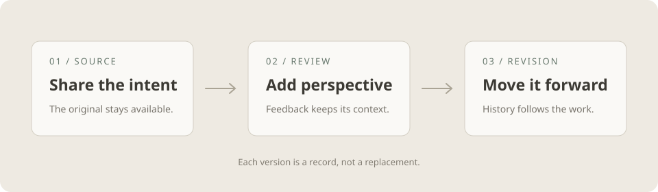
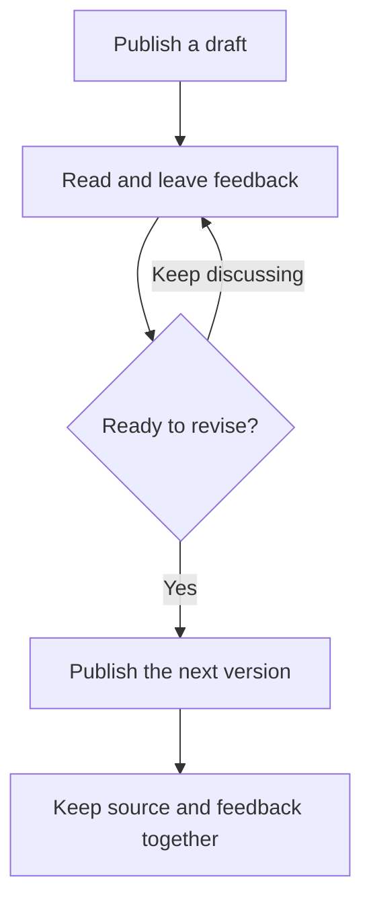

# A calmer review workflow

Good feedback should make the next revision easier. A small working agreement for sharing drafts, keeping context, and moving the work forward.

This proposal keeps the process deliberately light: publish a draft, invite a thoughtful review, and make a new revision when the changes are ready. Each version remains a useful record of what we knew and what we chose.

## Make room for useful feedback

Start with the decision you want to make. A clear question gives a reviewer somewhere to begin, whether they have five minutes or a full afternoon.

- Explain the intent before the implementation.
- Call out the choices that are still open.
  - Share the constraint that matters most.
  - Name the tradeoff you would like another perspective on.
- Keep references close to the claim they support.

### Before sharing a draft

- [x] Give the document a descriptive title
- [x] Include the context behind the proposal
- [ ] Invite a second perspective on the open questions
- [ ] Publish the next revision after addressing feedback

> A good review leaves the author with a clearer next step, and the reviewer with a better understanding of the work.

## A rhythm that respects attention

The review can be asynchronous without becoming impersonal. Agree on a small number of stages, make ownership visible, and let people spend their attention where it helps most.

| Stage | What happens | Who carries it |
| --- | --- | --- |
| Draft | Share the proposal and its open questions | Author |
| Review | Add specific feedback in the document | Reviewer |
| Revise | Publish a new version with the changes | Author or agent |
| Decide | Record the outcome and the next step | Team |

A comment belongs to the version it describes. When the proposal changes, the earlier conversation stays available as context. This makes it possible to understand the work without reconstructing it from memory.

## A little structure, underneath

The source remains plain Markdown. Feedback adds a saved version, a quoted passage, and enough context to find the relevant section again. The workflow can stay human while the handoff is precise.

```typescript
// Read the source and feedback for the same saved revision.
const draft = await artifacts.read({
  path: "review-workflow.md",
  version: 3,
});

const feedback = await comments.list({ version: draft.version });
const revision = await revise(draft.source, feedback);

await artifacts.publish(revision, {
  expectedVersion: draft.version,
  message: "Clarify ownership and the review rhythm",
});
```

Use `expectedVersion` to keep the revision tied to the draft that was reviewed. If another revision arrives first, pause and reconcile the changes before publishing.



## One source, a clearer next version

The review stays connected to the exact document that people read. A revision starts a new page in that history.



## What we can try this week

Choose one proposal that already needs a second perspective. Share the draft, ask one focused question, and review what made the exchange useful. We can refine the rhythm from that experience.

This is an invitation to make the work easier to understand. A lighter process should leave more room for the thinking itself.

---

[Return to the review rhythm](#a-rhythm-that-respects-attention)
